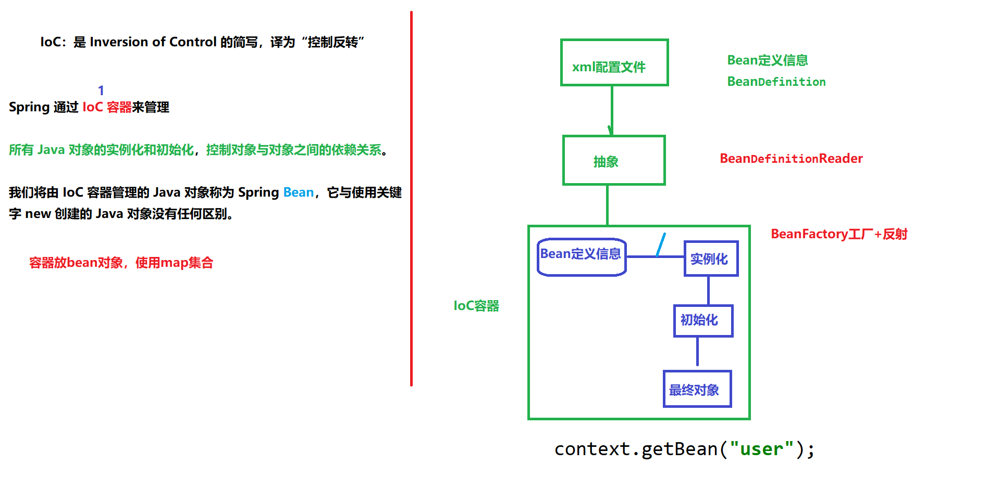

# spring6

## Bean

- spring中的 Bean 就是 java 对象

- **如何使用反射创建对象？**

    - 加载bean.xml配置文件
    - 对xml文件进行解析
    - 获取xml文件bean标签属性值：id值属性值和class属性值
    - 使用反射根据类全路径创建对象
    - 将创建的对象放到一个Map中（`key`：唯一标识，`value`：类的定义）

  ```java
  public class TestUser {
      @Test
      public void testUserObject1(){
          // 加载spring配置文件
          ApplicationContext context = new ClassPathXmlApplicationContext("bean.xml");
  
          // 获取创建的对象
          User user = (User)context.getBean("user");
          System.out.println(user);
  
          // 调用方法进行测试
          user.hello();
      }
  
      // 通过反射创建对象
      @Test
      public void testUserObject2() throws Exception{
          // 获取类class对象
          Class clazz = Class.forName("com.lm.spring6.User");
          
          // 调用方法创建对象
          User user = (User)clazz.getDeclaredConstructor().newInstance();
      }
  }
  ```


## Ioc容器

- **IOC容器**
    - spring通过**IOC容器**来管理：**所有对象的实例化和初始化，控制对象与对象之间的依赖关系。**
    - 容器使用map集合，存放Bean对象。




<center>
    IOC容器在spring中的实现
</center>


- **依赖注入**
    - 指spring创建对象过程中，将对象依赖属性通过配置注入
    - 实现方式有两种：
        - set注入
        - 构造注入
- **IOC就是一种控制反转的思想，而依赖注入是对IOC的实现**


## IOC基于xml管理Bean

- 获取`Bean`的方式

  ```xml
  <!--完成User对象创建
      Bean标签
          id属性：唯一标识
          class属性：要创建对象所在类的全路径（包名+类名）
      -->
      <bean id="user" class="com.lm.spring6.User"></bean>
  ```


  ```java
  // 1.根据id获取Bean
  ApplicationContext context = new ClassPathXmlApplicationContext("bean.xml");//获取ioc容器
  User user1 = (User)context.getBean("user");//获取Bean
  System.out.println("根据id获取Bean:"+user1);
  
  //2.根据类型获取Bean
  User user2 = context.getBean(User.class);
  System.out.println("根据类型获取Bean:"+user2);
  
  //3.根据id和类型获取Bean
  User user3 = context.getBean("user", User.class);
  System.out.println("根据id和类型获取Bean:"+user3);
  ```

- 如果一个组件类实现了接口，可以通过接口类型获取Bean；但是如果一个接口有多个实现类，则无法获取Bean;

- 依赖注入-基于setter方法

    - 创建类，定义属性，生成属性set方法

  ```java
  public class Book {
      private String name;
      private String author;
  }
  // set,get,constructor方法忽略
  ```

    - 在spring配置文件中配置

  ```xml
      <!--set 方法注入-->
      <bean id="book" class="com.lm.spring6.di.Book">
          <property name="name" value="book1"></property>
          <property name="author" value="ming"></property>
      </bean>
  ```

    - 测试

  ```java
  ApplicationContext context = new ClassPathXmlApplicationContext("bean-di.xml");
  Book book = context.getBean("book", Book.class);
  ```


- 依赖注入-基于构造器

    - 配置文件

  ```xml
      <!--constructor 构造方法注入-->
      <bean id="bookCon" class="com.lm.spring6.di.Book">
          <constructor-arg name="name" value="book2"></constructor-arg>
          <constructor-arg name="author" value="ming"></constructor-arg>
      </bean>
  ```

    - 测试

  ```java
  ApplicationContext context = new ClassPathXmlApplicationContext("bean-di.xml");
  Book book = context.getBean("bookCon", Book.class);
  ```

- 特殊类型注入

    - 创建类，定义属性

  ```java
  public class Student {
      private String name;
  
      private School school;
      
      private String[] course;
  
      public void study(){
          school.info(); // 调用 School对象的方法
      }
  }
  
  public class School {
      private String name;
  
      public void info(){
          System.out.println("name:" + name);
      }
  }
  ```

    - 配置文件

  ```xml
      <!--
      方法一：引入外部bean
      1. 创建对象：student 和 school
      2. 在student的标签中，使用property引入school的bean
      -->
  
      <bean id="student" class="com.lm.spring6.ditest.Student">
          <!--普通类型注入-->
          <property name="name" value="ming"></property>
          <!--对象类型注入-->
          <property name="school" ref="school"></property>
          <!--数组类型注入-->
          <property name="course">
              <array>
                  <value>数学</value>
                  <value>英语</value>
              </array>
          </property>
      </bean>
      <bean id="school" class="com.lm.spring6.ditest.School">
          <!--普通类型注入-->
          <property name="name" value="sjtu"></property>
  
      </bean>
  ```

    - 测试

  ```java
  @Test
  public static void main(String[] args) {
       ApplicationContext context = new ClassPathXmlApplicationContext("bean-di-test.xml");
       Student student = context.getBean("student",Student.class);
       student.study();
  }
  ```

- 引入外部属性文件（`jdbc.properties`）

  ```xml
  bean-jdbc.xml
  <!--引入外部属性标签-->    
  <context:property-placeholder location="classpath:jdbc.properties"></context:property-placeholder>
      
  <!--完成数据库注入-->    
  <bean id="druidDataSource" class="com.alibaba.druid.pool.DruidDataSource">
      <property name="url" value="${jdbc.url}"></property>
      <property name="username" value="${jdbc.username}"></property>
      <property name="password" value="${jdbc.password}"></property>
      <property name="driver" value="${jdbc.driver}"></property>    
  </bean>
  ```

- Bean 的作用域

  |       类型        |                 含义                  | 创建对象的时机  |
    | :---------------: | :-----------------------------------: | :-------------: |
  | singleton（默认） | 在IOC容器中这个Bean的对象始终为单实例 | IOC容器初始化时 |
  |     prototype     |      这个Bean在容器中有多个实例       |   获取Bean时    |

  ```xml
  <bean id="user" class="com.lm.spring6.User" scope="singleton"></bean>
  ```

- Bean 的生命周期

    - Bean 对象从创建到销毁的过程
        1. Bean对象的创建（调用无参数构造）
        2. 给Bean对象设置相关的属性（属性注入）
        3. Bean后置处理器（初始化之前）
        4. 对Bean对象初始化（调用指定的初始化方法）
        5. Bean后置处理器（初始化之后）
        6. Bean对象创建完成，可以使用
        7. Bean对象的销毁（配置指定销毁方法）
    - 对象属性及方法定义

  ```java
  public class User {
      private  String name;
  
      public User(){
          System.out.println("1.Bean对象创建，调用无参数构造……");
      }
      // 初始化方法
      public void initMethod(){
          System.out.println("4.调用指定初始化方法");
      }
      // 销毁方法
      public void destroyMethod(){
          System.out.println("7.Bean对象的销毁");
      }
  
      public String getName() {
          return name;
      }
  
      public void setName(String name) {
          System.out.println("2.设置属性值……");
          this.name = name;
      }
  }
  ```

    - 后置处理器

  ```java
  public class MyBeanPost implements BeanPostProcessor {
      @Override
      public Object postProcessBeforeInitialization(Object bean, String beanName) throws BeansException {
          System.out.println("3.Bean后置处理器（初始化之前）");
          return BeanPostProcessor.super.postProcessBeforeInitialization(bean, beanName);
      }
  
      @Override
      public Object postProcessAfterInitialization(Object bean, String beanName) throws BeansException {
          System.out.println("5.Bean后置处理器（初始化之后）");
          return BeanPostProcessor.super.postProcessAfterInitialization(bean, beanName);
      }
  }
  ```

    - 配置文件(`bean-life.xml`)

  ```xml
  <bean id="user" class="com.lm.spring6.beanlife.User" scope="singleton"
        init-method="initMethod" destroy-method="destroyMethod">  
      <property name="name" value="ming"></property>
  </bean>    
  <!--Bean的后置处理器需要放入IOC容器才能生效-->
  <bean id="myBeanPost" class="com.lm.spring6.beanlife.MyBeanPost"></bean>
  ```

    - 测试

  ```java
  public class TestUser {
      public static void main(String[] args) {
          ClassPathXmlApplicationContext context = new ClassPathXmlApplicationContext("bean-life.xml");
          context.getBean("user",User.class);
          System.out.println("6.Bean对象创建完成，可以使用");
          // 注意：使用ClassPathXmlApplicationContext接口，才有close()方法
          context.close();// 销毁对象
      }
  }
  ```

- 基于xml实现自动装配

  ```xml
  <bean id="userController" class="com.lm.spring6.auto.controller.UserController" 
        autowire="byType">
  </bean>
  <bean id="userService" class="com.lm.spring6.auto.service.UserServiceImpl" autowire="byType"></bean>
  <bean id="userDao" class="com.lm.spring6.auto.dao.UserDaoImpl"></bean>
  ```

  自动装配方式有两种：

    - `byType`：根据类型匹配Ioc容器中的Bean，为属性自动复赋值；
    - `byName`：将自动装配的属性名，作为Bean的id去匹配对应的Bean进行属性赋值；

## 基于注解管理Bean

- spring 通过注解实现自动装配的步骤如下：

    - 引入依赖
    - 开启组件扫描
    - 使用注解定义Bean
    - 依赖注入

  ```xml
  <!--开启组件扫描
  扫描路径下的所有包，如果一个类加了注解，则将其装配到容器
  -->    
  <context:component-scan base-package="com.lm"></context:component-scan>
  ```

- 可以定义Bean的注解

    - `@Component`：泛化的概念，可以用于任何层；
    - `@Respository`：用于数据访问层；
    - `@Service`：用于业务层；
    - `@Controller`：用于控制层；

- `@Autowired`注入

    - 默认`byType`方式装配
    - 注入方法

  ```java
  @Controller
  public class UserController {
      // 方法一：属性注入
      @Autowired
      private UserService userService;
  
      // 方法2：set方法注入
      @Autowired
      public void setUserService(UserService userService) {
          this.userService = userService;
      }
  
      // 方法3：构造方法注入
      @Autowired
      public UserController(UserService userService){
          this.userService = userService;
      }
      
      // 方法4：形参上注入
      private UserService userService;
  
      public UserController(@Autowired UserService userService){
          this.userService = userService;
      }
  
      public void addUser(){
          System.out.println("Controller方法执行……");
          userService.addUserService();
      }
  }
  ```

- `@Resource`注入

    - `@Resource`时java扩展包中的，也就是JDK的，所以是标准注解，更加通用；
    - `@Autowired`是spring框架中的；
    - 默认根据 `byName`装配；

## 反射机制

- 获取Class对象的方式

  ```java
  // 类名.class
  Class clazz1 = User.class;
  
  // 对象.getClass()
  Class clazz2 = new User().getClass();
  
  // Class.forName("全路径")
  Class clazz3 = Class.forName("com.lm.User");
  
  // 实例化
  User user =(User)clazz1.getDeclaredConstructor().newInstance();
  ```

- 获取构造方法

  ```java
  Class clazz = User.class;
          
  // 获取所有public构造方法
  Constructor[] constructors1 = clazz.getConstructors();
          
  // 获取所有构造方法(包括private)
  Constructor[] constructors2 = clazz.getDeclaredConstructors();
  
  // 指定有参数构造创建对象
  //public        
  Constructor c1 = clazz.getConstructor(String.class,int.class);        
  User user1 = (User)c1.newInstance("ming",21);  
  // private
  Constructor c2 = clazz.getDeclaredConstructor(String.class, int.class);        
  c2.setAccessible(true); // 设置允许访问        
  User user2 = (User)c2.newInstance("ming",21);
  ```

- 获取属性

  ```java
  Class clazz = User.class;
  // 获取所有public属性
  Field[] fields1 = clazz.getFields();
          
  // 获取所有属性（包括private）
  Field[] fields2 = clazz.getDeclaredFields();
  ```

- 获取方法

  ```java
  User user = new User("ming",21);
  Class clazz = user.getClass();
  
  // public 方法
  Method[] methods1 = clazz.getMethods();
  for(Method m:methods1){
      if(m.getName().equals("toString")){
          m.invoke(user); // 执行 toString()方法
      }
  }
  
  // private
  Method[] methods2 = clazz.getDeclaredMethods();
  for(Method m:methods2){
      if(m.getName().equals("run")){
          m.setAccessible(true); // 设置允许访问
          m.invoke(user); // 执行 private run()方法
      }
  }
  ```


## 手写IOC容器

实现：**Java 反射 + 注解**

- 创建两个注解：

    - `@Bean `：创建对象

      ```java
      @Target(ElementType.TYPE) // 作用在类对象上
      @Retention(RetentionPolicy.RUNTIME) // 运行时生效
      public @interface Bean {
      }
      ```

    - `@Di`：属性注入

      ```java
      @Target(ElementType.FIELD) // 使用在属性上
      @Retention(RetentionPolicy.RUNTIME) // 运行时生效
      public @interface Di {
      }
      ```

- 创建Bean容器接口 ApplicationContext，定义方法，返回对象；

  ```java
  public interface ApplicationContext {
      // 返回Bean对象
      Object getBean(Class clazz) throws NoSuchMethodException;
  }
  ```

- 实现Bean容器接口

    - 返回对象
    - 创建有参构造器，传递包路径，设置包扫描规则
    - 根据包规则加载Bean（）
    - 属性注入

  ```java
  public class AnnotationApplicationContext implements ApplicationContext {
      // 创建map集合，存放Bean对象
      private  Map<Class,Object> beanFactory = new HashMap<>();
      private  String rootPath; // 前路径
      
      // fa
      @Override
      public Object getBean(Class clazz) throws NoSuchMethodException {
          return beanFactory.get(clazz);
      }
  
      // 创建有参构造器，传递包路径，设置包扫描规则
      // 当前包及子包中，如果哪个类有@Bean注解，则通过反射将其实例化
      public  AnnotationApplicationContext(String basePackage){
          try {
              // 1. 将.替换为\
              String packagePath = basePackage.replaceAll("\\.","\\\\");
              // 2. 获取包的绝对路径
              Enumeration<URL> urls = Thread.currentThread().getContextClassLoader()
                                      .getResources(packagePath);
              while(urls.hasMoreElements()){
                  URL url = urls.nextElement();
                  String filePath = URLDecoder.decode(url.getFile(), StandardCharsets.UTF_8);
  
                  // 截取前路径
                  rootPath = filePath.substring(0, filePath.length() - packagePath.length());
                  // 包扫描
                  loadBean(new File(filePath));
              }
          } catch (Exception e) {
              throw new RuntimeException(e);
          }
  
          // 属性注入
          loadDi();
      }
  
  ```

- 包扫描加载`Bean`实现

  ```java
  // 包扫描过程，实例化
  public void loadBean(File file) throws Exception {
      // 判断当前内容是否是一个文件夹
      if(file.isDirectory()) {
          // 获取文件夹中的所有内容
          File[] subFiles = file.listFiles();
          // 判断文件夹是否为空
          if(subFiles==null||subFiles.length==0){
              return;
          }
          // 遍历文件夹所有内容
          for(File subfile:subFiles){
              // 递归遍历文件夹及子文件夹
              if(subfile.isDirectory()){
                  // 如果是文件夹，递归遍历
                  loadBean(subfile);
              }else{
                  // 得到包路径+类名
                  String pathWithClass = subfile.getAbsolutePath().substring(rootPath.length()-1);
                  // 判断当前文件类型是否为.class
                  if(pathWithClass.endsWith(".class")){
                      // 把\换成. 并去掉.class后缀
                      String allName = pathWithClass.replaceAll("\\\\",".").replace(".class","");
                      // 对有注解 @Bean的类进行实例化
                      Class<?> clazz = Class.forName(allName);
                      // 判断是否为接口
                      if(!clazz.isInterface()){
                          // 判断有无注解
                          Bean annotation = clazz.getAnnotation(Bean.class);
                          if(annotation != null){
                              // 实例化对象
                              Object instance = clazz.getConstructor().newInstance();
                              // 实例化后的对象放入到map集合中
                              // 如果有接口，接口作为key
                              if(clazz.getInterfaces().length>0){
                                  beanFactory.put(clazz.getInterfaces()[0],instance);
                              }else{
                                  beanFactory.put(clazz,instance);
                              }
                          }
                      }
                  }
              }
          }
      }
  
  }
  ```

- 属性注入实现

  ```java
  public void loadDi(){
      // 遍历 map 集合
      for(Map.Entry<Class,Object> entry:beanFactory.entrySet()){
          Object obj = entry.getValue();
          Class<?> clazz = obj.getClass();
          // 获取每个对象的属性
          Field[] fields = clazz.getDeclaredFields();
          // 遍历得到对象的属性数组，得到每个属性
          for(Field field:fields){
              // 判断属性上是否有 @Di 注解，把对象进行注入
              Di annotation = field.getAnnotation(Di.class);
              if(annotation!=null){
                  field.setAccessible(true);
                  try {
                      field.set(obj,beanFactory.get(field.getType()));
                  } catch (IllegalAccessException e) {
                      throw new RuntimeException(e);
                  }
              }
          }
      }
  }
  ```


## 代理模式

- **代理模式**：代理模式给某一个对象提供一个代理对象，并由代理对象控制对原对象的引用。通俗的来讲代理模式就是我们生活中常见的中介。

- **静态代理**：通过将目标类与代理类实现同一个接口，让代理类持有真实类对象，然后在代理类方法中调用真实类方法，在调用真实类方法的前后添加我们所需要的功能扩展代码来达到增强的目的。

    - 接口

      ```java
      public interface UserService {
          public void add();
          public void delete();
          public void update();
          public void query();
      }
      ```

    - 真实类

      ```java
      public class UserServiceImpl implements UserService{
          @Override
          public void add() {
              System.out.println("增加了一个用户");
          }
      
          @Override
          public void delete() {
              System.out.println("删除了一个用户");
          }
      
          @Override
          public void update() {
              System.out.println("修改了一个用户");
          }
      
          @Override
          public void query() {
              System.out.println("查询了一个用户");
          }
      }
      ```

    - 代理类

      ```java
      public class UserServiceProxy implements UserService{
          // 注入真实类对象
          private UserServiceImpl userService;
      
          public void setUserService(UserServiceImpl userService) {
              this.userService = userService;
          }
      
          @Override
          public void add() {
              log("add");
              userService.add();
          }
      
          @Override
          public void delete() {
              log("delete");
              userService.delete();
          }
      
          @Override
          public void update() {
              log("update");
              userService.update();
          }
      
          @Override
          public void query() {
              log("query");
              userService.query();
          }
      
          //增加日志打印
          public void log(String msg){
              System.out.println("使用了"+msg+"方法");
          }
          //1.改动原有的业务代码,在公司中是大忌!
      
      }
      ```

    - 客户端（测试）

      ```java
      public class Client {
          public static void main(String[] args) {
              UserServiceImpl userService = new UserServiceImpl();
      //        userService.add();      //不使用代理
              UserServiceProxy userServiceProxy =new UserServiceProxy();
              userServiceProxy.setUserService(userService);
              userServiceProxy.add();
              userServiceProxy.delete();
          }
      }
      ```

    - 静态代理的缺点：对于每一个真实类对象都要创建一个代理类，开发效率低；

- **动态代理**：在程序运行期，创建目标对象的代理对象，并对目标对象中的方法进行功能性增强的一种技术

    - 接口

      ```java
      public interface UserService {
          public void add();
          public void delete();
          public void update();
          public void query();
      }
      ```

    - 真实类

      ```java
      public class UserServiceImpl implements UserService {
          @Override
          public void add() {
              System.out.println("增加了一个用户");
          }
      
          @Override
          public void delete() {
              System.out.println("删除了一个用户");
          }
      
          @Override
          public void update() {
              System.out.println("修改了一个用户");
          }
      
          @Override
          public void query() {
              System.out.println("查询了一个用户");
          }
      }
      ```

    - 代理类

      ```java
      public class ProxyInvocationHandler implements InvocationHandler {
          // 被代理的对象
          private Object target;
          public void setTarget(Object target){
              this.target = target;
          }
      
          // 生成代理类
          public Object getProxy(){
              // 三个参数
              // 1. 加载动态生成代理类的类加载器
              // 2. 目标对象实现的所有接口的Class类型数组
              // 3 .设置代理对象实现目标对象方法的过程
              return Proxy.newProxyInstance(this.getClass().getClassLoader(),
                                            target.getClass().getInterfaces(),this);
          }
      
          // 处理代理实例，并返回结果
          // 参数1：代理对象
          // 参数2：代理对象需要实现的方法
          // 参数3：method方法里面的参数
          @Override
          public Object invoke(Object proxy, Method method, Object[] args) throws Throwable {
              // 动态代理的本质，就是使用反射机制实现
              log(method.getName());
              Object result = method.invoke(target,args);
              return result;
          }
      
          public void log(String msg){
              System.out.println("执行了"+msg+"方法");
          }
      }
      ```

    - 客户端（测试）

      ```java
      public class Client {
          public static void main(String[] args) {
              //真实角色
              UserServiceImpl userService = new UserServiceImpl();
      
              //代理角色，不存在
              ProxyInvocationHandler pih = new ProxyInvocationHandler();
              pih.setTarget(userService); //设置要代理的对象
      
              //动态生成代理类
              UserService proxy = (UserService) pih.getProxy();
              proxy.query();
              proxy.add();
          }
      }
      ```

    - 结果

      ```bash
      执行了query方法
      查询了一个用户
      执行了add方法
      增加了一个用户
      ```


## AOP

- **AOP**：是一种设计思想，通过**预编译**方式和**运行期间动态代理**方式实现，在不修改源码的情况下，给程序动态添加额外功能的一种技术。

  优点：对业务逻辑各部分进行**解耦**，提高程序的可重用性，提高开发效率。

- 动态代理的分类

    - JDK动态代理：（有接口的情况）代理对象和目标对象实现同样的接口
    - cglib动态代理：（没有接口的情况）继承被代理的目标类

- 相关术语

    - **连接点**：描述的是程序执行的某个特定位置。如一个类的初始化前、初始化后，或者类的某个方法调用前、调用后、方法抛出异常后等等；
    - **切入点**：是一个连接点的过滤条件，AOP 通过切点定位到特定的连接点。类比：连接点相当于数据库中的记录，切点相当于查询条件；
    - **通知**：切面在某个具体的连接点采取的行为或行动，切面的核心逻辑代码都写在通知中，有人也称之为增强或者横切关注点。通知是切面功能的具体实现，通常是业务代码以外的需求，如日志、验证等，这些被模块化的特殊对象。

## 基于注解实现AOP

- 引入对应的依赖

  ```xml
      <dependency>
          <groupId>org.springframework</groupId>
          <artifactId>spring-aop</artifactId>
          <version>6.0.9</version>
      </dependency>
  
      <dependency>
          <groupId>org.springframework</groupId>
          <artifactId>spring-aspects</artifactId>
          <version>6.0.7</version>
      </dependency>
  ```

- 创建目标资源

  ```java
  public interface UserService {
      public void add();
      public void delete();
      public void update();
      public void query();
  }
  ```

  ```java
  @Service
  public class UserServiceImpl implements UserService {
      @Override
      public void add() {
          System.out.println("增加了一个用户");
      }
  
      @Override
      public void delete() {
          System.out.println("删除了一个用户");
      }
  
      @Override
      public void update() {
          System.out.println("修改了一个用户");
      }
  
      @Override
      public void query() {
          System.out.println("查询了一个用户");
      }
  }
  ```

- 创建切面类并进行配置

  ```java
  // 切面类
  @Component
  @Aspect
  public class LogAspects {
      // 设置切入点和通知类型
      
      // 通知类型
      // 前置：@Before()
      // 返回：@AfterReturning
      // 异常：@AfterThrowing
      // 后置：@After()
      // 环绕：@Around()
  
      @Before("execution(* com.lm.service.UserServiceImpl.*(..))")
      public void beforeMethod(){
          System.out.println("(注解方式)====方法执行前====");
      }
  
      @After("execution(* com.lm.service.UserServiceImpl.*(..))")
      public void afterMethod(){
          System.out.println("(注解方式)====方法执行后====");
      }
  
      //在环绕增强中，我们可以给定一个参数，代表我们要获取处理切入的点;
      @Around("execution(* com.lm.service.UserServiceImpl.*(..))")
      public void aroundMethod(ProceedingJoinPoint pj) throws Throwable{
          System.out.println("环绕前");
          Signature signature = pj.getSignature(); //获得签名
          System.out.println("signature: "+signature);
  
          Object proceed = pj.proceed();   //执行方法
          System.out.println("环绕后");
      }
  }
  ```

- **编写applicationContext.xml文件**

  ```xml
  <?xml version="1.0" encoding="UTF-8"?>
  <beans xmlns="http://www.springframework.org/schema/beans"
         xmlns:xsi="http://www.w3.org/2001/XMLSchema-instance"
         xmlns:aop="http://www.springframework.org/schema/aop"
         xmlns:context="http://www.springframework.org/schema/context"
         xsi:schemaLocation="http://www.springframework.org/schema/beans
         http://www.springframework.org/schema/beans/spring-beans.xsd
         http://www.springframework.org/schema/aop
         http://www.springframework.org/schema/aop/spring-aop.xsd
         http://www.springframework.org/schema/context
         https://www.springframework.org/schema/context/spring-context.xsd">
  
      <!--开启组件扫描-->
      <context:component-scan base-package="com.lm"></context:component-scan>
      
      <!--开启注解支持!   JDK(默认 proxy-target-class="false" )   cglib(  proxy-target-class="true")-->
      <aop:aspectj-autoproxy></aop:aspectj-autoproxy>
  </beans>
  ```

- 测试

  ```java
  public class TestAspects {
      public static void main(String[] args) {
          ApplicationContext context = new ClassPathXmlApplicationContext("applicationContext.xml");
          UserService userService = context.getBean(UserService.class);
          userService.add();
      }
  }
  ```

- 结果

  ```shell
  环绕前
  signature: void com.lm.service.UserService.add()
  (注解方式)====方法执行前====
  增加了一个用户
  (注解方式)====方法执行后====
  环绕后
  ```

  